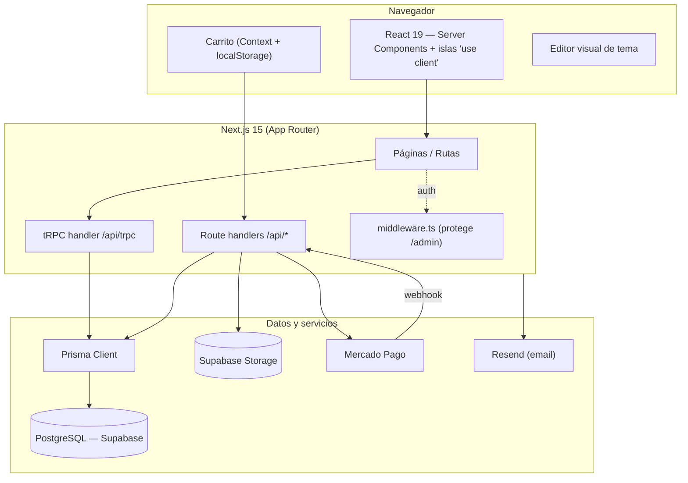
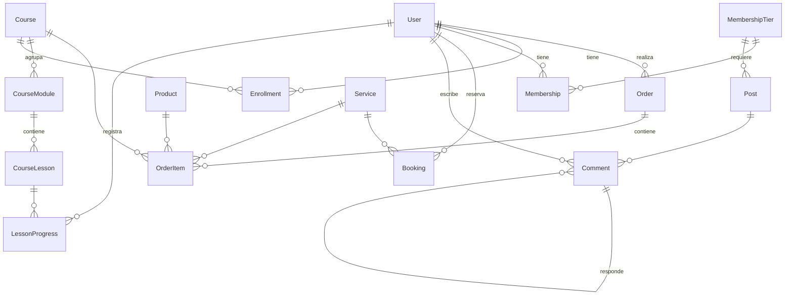

# La Reina de Bastos — Documentación del Sistema

Documentación técnica **end-to-end** de la plataforma: tienda, cursos, membresía
(Círculo), servicios/reservas, newsletter, panel de administración y editor
visual. Para el detalle del cobro ver [`PAGOS-MERCADOPAGO.md`](PAGOS-MERCADOPAGO.md).

## Índice

1. [Qué es](#1-qué-es)
2. [Stack técnico](#2-stack-técnico)
3. [Arquitectura general](#3-arquitectura-general)
4. [Estructura de carpetas](#4-estructura-de-carpetas)
5. [Modelo de datos](#5-modelo-de-datos)
6. [Autenticación y autorización](#6-autenticación-y-autorización)
7. [Capa de API](#7-capa-de-api)
8. [Módulos funcionales](#8-módulos-funcionales)
9. [Almacenamiento de archivos](#9-almacenamiento-de-archivos)
10. [Frontend y sistema visual](#10-frontend-y-sistema-visual)
11. [Editor visual de tema](#11-editor-visual-de-tema)
12. [Variables de entorno](#12-variables-de-entorno)
13. [Puesta en marcha (local)](#13-puesta-en-marcha-local)
14. [Despliegue](#14-despliegue)
15. [Estado y roadmap](#15-estado-y-roadmap)

---

## 1. Qué es

Sitio e-commerce + membresía para la marca espiritual **La Reina de Bastos**.
Ofrece tres líneas de negocio y una comunidad:

- **Tienda** — productos físicos, digitales y personalizados.
- **Cursos** — con lecciones, módulos, drip content y seguimiento de progreso.
- **Servicios** — sesiones 1:1 con sistema de reservas.
- **El Círculo** — membresía única que desbloquea todos los cursos + un feed
  privado de contenido y comunidad (comentarios).
- **Newsletter** — captación de suscriptoras.

Todo administrable desde un panel `/admin` propio, con un editor visual de marca
en vivo.

---

## 2. Stack técnico

| Capa | Tecnología |
|---|---|
| Framework | **Next.js 15** (App Router, React 19, Server Components) |
| Lenguaje | **TypeScript** |
| Estilos | **Tailwind CSS 4** (`@theme` tokens) + fuentes locales `next/font` |
| API tipada | **tRPC 11** (+ TanStack React Query) |
| ORM | **Prisma 6** → **PostgreSQL** (Supabase) |
| Auth | **NextAuth 5** (Auth.js) — JWT, Credentials + Google + Resend |
| Almacenamiento | **Supabase Storage** (bucket `uploads`) |
| Pagos | **Mercado Pago** (Checkout Pro) — SDK `mercadopago` |
| Email | **Resend** (magic links; base para transaccionales) |
| Validación | **Zod** |

Es una base **T3 Stack** (`create-t3-app`).

---

## 3. Arquitectura general



**Principios:**
- Las páginas son **Server Components** por defecto; la interactividad vive en
  islas `"use client"` (carrito, editor, formularios).
- Los datos de lectura fluyen por **tRPC** (tipado punta a punta).
- Las integraciones externas y multipart (pagos, webhooks, uploads, registro)
  usan **route handlers REST** (`/api/*`).
- La sesión se resuelve por **JWT** para que el middleware Edge no cargue Prisma.

---

## 4. Estructura de carpetas

```
belen/
├─ prisma/
│  ├─ schema.prisma          # Modelo de datos completo
│  └─ seed.ts                # Datos iniciales (npm run db:seed)
├─ generated/prisma/         # Prisma Client generado (no editar)
├─ src/
│  ├─ env.js                 # Schema de variables de entorno (@t3-oss/env)
│  ├─ middleware.ts          # Protección de rutas /admin
│  ├─ styles/globals.css     # Tailwind 4 + tokens @theme de marca
│  ├─ fonts/                 # Fuentes locales (.ttf/.otf)
│  ├─ trpc/                  # Cliente tRPC (react.tsx, server.ts)
│  ├─ lib/
│  │  ├─ mercadopago.ts      # Cliente SDK de MP
│  │  ├─ settings.ts         # settings.json (token OAuth de MP)
│  │  ├─ access.ts           # Reglas de acceso (membresía/cursos)
│  │  ├─ upload.ts           # Subida a Supabase Storage
│  │  ├─ embed.ts            # Helpers de embeds de video
│  │  └─ supabase/           # Clientes Supabase (browser/server)
│  ├─ server/
│  │  ├─ db.ts               # Instancia de Prisma
│  │  ├─ auth/               # config NextAuth (config.ts, edge-config.ts, index.ts)
│  │  └─ api/
│  │     ├─ trpc.ts          # Context + procedures (public/protected/admin)
│  │     ├─ root.ts          # Router raíz
│  │     └─ routers/         # Un router por dominio
│  └─ app/
│     ├─ layout.tsx          # Root layout (fuentes, providers globales)
│     ├─ page.tsx            # Homepage
│     ├─ _components/        # Componentes compartidos (home, cart, editor…)
│     ├─ (rutas públicas)/   # tienda, cursos, servicios, circulo, …
│     ├─ admin/              # Panel de administración
│     └─ api/                # Route handlers REST
```

---

## 5. Modelo de datos

Definido en [`prisma/schema.prisma`](prisma/schema.prisma). Agrupado por dominio:

**Auth (NextAuth):** `User`, `Account`, `Session`, `VerificationToken`.
`User.isAdmin` marca administradores; `User.passwordHash` habilita login por
contraseña (null para Google/Resend).

**Catálogo:** `Product`, `Course` → `CourseModule` → `CourseLesson`, `Service`.

**Órdenes:** `Order` → `OrderItem` (polimórfico: apunta a product/course/service).

**Acceso:** `Enrollment` (curso comprado suelto, legacy), `Booking` (reserva de
servicio), `LessonProgress` (lección completada por usuaria).

**Círculo:** `MembershipTier`, `Membership`, `Post`, `Comment`.

**Newsletter:** `Subscriber`.



**Enums:** `ProductType` (FISICO/DIGITAL/PERSONALIZADO), `OrderStatus`
(PENDING/PAID/FAILED/CANCELLED), `ItemType` (PRODUCT/COURSE/SERVICE),
`MembershipStatus` (PENDING/ACTIVE/CANCELLED/PAST_DUE), `PostType`
(TEXT/VIDEO/AUDIO/GALLERY).

---

## 6. Autenticación y autorización

Config en [`src/server/auth/config.ts`](src/server/auth/config.ts).

**Proveedores (se activan según env):**
- **Credentials** (siempre): email + contraseña, validado con `bcryptjs` contra
  `User.passwordHash`.
- **Google** (si `AUTH_GOOGLE_ID`/`SECRET`).
- **Resend** (si `AUTH_RESEND_KEY`): magic link por email.

**Sesión:** estrategia **JWT** (no DB). En el JWT se guarda `isAdmin` para no
consultar la base en cada request.

**Administradores:** whitelist `ADMIN_EMAILS` (env, separada por comas). Al
registrarse un email de la whitelist, el `event createUser` lo marca
`isAdmin: true`. También se respeta `User.isAdmin` si ya está seteado.

**Protección de rutas:**
- [`src/middleware.ts`](src/middleware.ts) intercepta `/admin/*` (salvo
  `/admin/login`): sin sesión → `/login`; sesión no-admin → `/`.
- En la capa API, `adminProcedure` exige `isAdmin`; `protectedProcedure` exige
  sesión.
- **Escape hatch de desarrollo:** en `NODE_ENV=development` **sin** credenciales
  de Google configuradas, tanto el middleware como `adminProcedure` dejan pasar,
  para poder trabajar local sin montar auth. En producción esto no aplica.

---

## 7. Capa de API

### 7.1 tRPC — routers y procedimientos

Router raíz en [`src/server/api/root.ts`](src/server/api/root.ts). El context
([`trpc.ts`](src/server/api/trpc.ts)) expone `db` (Prisma) y `session`.

| Router | Procedimientos | Acceso |
|---|---|---|
| `products` | `list`, `bySlug` | público |
| `courses` | `list`, `bySlug` | público |
| `services` | `list`, `bySlug` | público |
| `circulo` | `feed`, `bySlug` | público |
| `comments` | `list` · `create`, `delete` | público · protegido |
| `newsletter` | `subscribe` · `list`, `setActive` | público · admin |
| `orders` | `create` | público |
| `account` | `me`, `membership`, `cancelMembership`, `orders`, `enrollments`, `bookings` | protegido |
| `progress` | `forCourse`, `view`, `setCompleted` | protegido |
| `admin` | `stats`; sub-routers `cursos`, `productos`, `servicios`, `posts` (CRUD completo + módulos/lecciones), `usuarios.list`, `ordenes.list`, `reservas.list`, `comentarios.recent` | admin |

### 7.2 Route handlers REST (`/api/*`)

| Ruta | Rol |
|---|---|
| `/api/auth/[...nextauth]` | NextAuth (login/logout/callbacks) |
| `/api/auth/register` | Registro con email + contraseña |
| `/api/trpc/[trpc]` | Entrada de tRPC |
| `/api/mp/create-preference` | Crea preferencia de pago (ver doc de pagos) |
| `/api/mp/webhook` | Notificaciones de pago de MP |
| `/api/admin/mp-connect`, `/api/admin/mp-callback` | OAuth "Conectar cuenta" de MP |
| `/api/admin/settings` | Lee/actualiza settings de MP (conectado, modo) |
| `/api/admin/upload`, `/upload-pdf`, `/upload-audio` | Subida de imágenes / PDF / audio |
| `/api/bookings/create` | Alta de reserva de servicio |
| `/api/checkout/digital` | Checkout de producto digital |

---

## 8. Módulos funcionales

### 8.1 Tienda
- **Datos:** `Product` (tipo físico/digital/personalizado, precio, imágenes,
  stock, features…).
- **Rutas:** `/tienda` (catálogo), `/tienda/[slug]` (detalle).
- **Carrito:** `CartContext` (React Context + `localStorage` `rdb_cart`).
- **Checkout:** redirige a **Mercado Pago Checkout Pro** → ver
  [`PAGOS-MERCADOPAGO.md`](PAGOS-MERCADOPAGO.md).

### 8.2 Cursos + El Círculo (membresía)
- **Datos:** `Course` → `CourseModule` → `CourseLesson`. Las lecciones soportan
  **drip** (`publishedAt` futuro = se libera ese día) y **preview gratis**
  (`freePreview`).
- **Acceso (modelo único):** una `Membership` con estado `ACTIVE` desbloquea
  **todos** los cursos + el feed del Círculo. Regla central en
  [`src/lib/access.ts`](src/lib/access.ts) (`hasActiveMembership`,
  `hasCourseAccess`). Se mantiene compatibilidad con `Enrollment` viejos (cursos
  comprados sueltos).
- **Feed del Círculo:** `Post` (texto/video/audio/galería) con comentarios
  anidados (`Comment` con `parentId`).
- **Progreso:** `LessonProgress` (única por `userId+lessonId`); router
  `progress`.
- **Rutas:** `/cursos`, `/cursos/[slug]`, `/cursos/[slug]/ver` (player),
  `/circulo`, `/circulo/[slug]`, `/suscripciones`.

### 8.3 Servicios + Reservas
- **Datos:** `Service` (duración, formato/Zoom, contenido). Reservas en
  `Booking`.
- **Rutas:** `/servicios`, `/servicios/[slug]`, `/reservas`. Alta vía
  `/api/bookings/create`. Disponibilidad administrable en
  `/admin/disponibilidad`.

### 8.4 Newsletter
- `Subscriber` (email único, `active`, `source`). `newsletter.subscribe`
  (público) desde la homepage; gestión en `/admin/newsletter`.

### 8.5 Cuenta de usuaria
- `/registro`, `/login`, `/mi-cuenta`. Router `account` expone perfil,
  membresía, órdenes, inscripciones y reservas propias.

### 8.6 Panel de administración (`/admin`)
Dashboard con `stats` y CRUD completo de **productos, cursos (con módulos y
lecciones), servicios, posts del Círculo**, además de **usuarios, órdenes,
reservas, newsletter, emails, disponibilidad** y **configuración de Mercado
Pago**. Protegido por middleware + `adminProcedure`.

---

## 9. Almacenamiento de archivos

[`src/lib/upload.ts`](src/lib/upload.ts) → **Supabase Storage**, bucket público
`uploads` (creado on-demand, límite 50 MB), usando `SUPABASE_SERVICE_ROLE_KEY`.
Reemplaza escrituras a `public/uploads` (que no funcionan en el filesystem de
solo lectura de Vercel). Los endpoints `/api/admin/upload*` validan el tipo de
archivo y devuelven la URL pública. El editor visual también sube fondos por
acá.

---

## 10. Frontend y sistema visual

- **App Router + Server Components:** cada página server-render y compone islas
  cliente donde hace falta.
- **Providers globales** ([`layout.tsx`](src/app/layout.tsx)): `TRPCReactProvider`
  y `CartProviders` (que anida `SessionProvider` → `CartProvider` →
  `ThemeEditorProvider`). Adornos: `MagicCursor`, `VinylPlayer`, `PageTransition`.
- **Tipografía:** fuentes locales cargadas con `next/font/local` (familia groovy
  + `Lostar`, `Chevrola`, etc.) y `Jost` (Google) para el cuerpo. Cada una expone
  una CSS var (`--font-*`).
- **Tailwind 4:** los colores y fuentes de marca se declaran como tokens en el
  bloque `@theme` de `globals.css`, que emite variables CSS en `:root`. Las
  utilidades (`bg-morado`, `font-display`) referencian esas variables — por eso
  el editor puede cambiarlas en vivo.
- **Paleta de marca:** verdes selva, celestes, dorados, naranjas, fucsias,
  morados y neutros crema/tierra (estética flower-power/psicodélica).

---

## 11. Editor visual de tema

Sistema propio para editar la identidad visual **en vivo**, solo para admins.

- **Componentes:** [`ThemeEditorContext`](src/app/_components/editor/ThemeEditorContext.tsx)
  (provider + estado), [`ThemeEditorPanel`](src/app/_components/editor/ThemeEditorPanel.tsx)
  (panel lateral, `createPortal` al body),
  [`EditableSection`](src/app/_components/editor/EditableSection.tsx) (envuelve
  secciones para poder editar su fondo) y
  [`theme-tokens.ts`](src/app/_components/editor/theme-tokens.ts) (definición de
  colores, roles de fuente y opciones).
- **Tres pestañas:**
  - **Colores** — color picker por cada token de marca; aplica overrides sobre
    `document.documentElement`.
  - **Fuentes** — elegir tipografía por rol (Títulos / Acento / Cuerpo) entre las
    fuentes cargadas.
  - **Fondos** — a cada `EditableSection` se le puede poner imagen de fondo,
    ajustar encuadre (cover/contain + posición), aplicar velo y retocar
    (brillo/contraste/saturación/blur). Incluye galería reutilizable de fondos
    subidos.
- **Persistencia:** los cambios se guardan en **`localStorage`** del navegador
  (claves `rdb_theme_overrides`, `rdb_section_bgs`, `rdb_bg_library`). Es un
  **preview por navegador**, no global.
- **Botón "Copiar CSS":** exporta los overrides como bloque `:root { … }` para
  pegarlos definitivamente en `globals.css`.

> **Limitación conocida:** el editor no persiste en la base de datos, así que los
> cambios no se ven para todas las visitantes hasta llevarlos a `globals.css`.
> Persistirlos (modelo `SiteTheme` + inyección en `<head>`) es una mejora futura.

---

## 12. Variables de entorno

Schema en [`src/env.js`](src/env.js). `SKIP_ENV_VALIDATION=1` saltea la
validación (útil mientras faltan servicios).

| Variable | Ámbito | Descripción |
|---|---|---|
| `DATABASE_URL` | servidor | Postgres (pooler 6543) para Prisma |
| `DIRECT_URL` | servidor | Conexión directa (5432) para migraciones |
| `AUTH_SECRET` | servidor | Secret de NextAuth |
| `AUTH_GOOGLE_ID` / `AUTH_GOOGLE_SECRET` | servidor | Login con Google (opcional) |
| `AUTH_RESEND_KEY` | servidor | Magic link por email (opcional) |
| `ADMIN_EMAILS` | servidor | Whitelist de admins (coma-separada) |
| `NEXT_PUBLIC_SITE_URL` | cliente | URL pública (back_urls MP, links email) |
| `NEXT_PUBLIC_SUPABASE_URL` | cliente | Proyecto Supabase |
| `NEXT_PUBLIC_SUPABASE_ANON_KEY` | cliente | Clave anónima Supabase |
| `SUPABASE_SERVICE_ROLE_KEY` | servidor | Clave service-role (Storage/admin) |
| `MP_ACCESS_TOKEN` | servidor | Token de Mercado Pago (cobra) |
| `NEXT_PUBLIC_MP_PUBLIC_KEY` | cliente | Public key de MP |
| `MP_WEBHOOK_SECRET` | servidor | Valida firma del webhook |
| `MP_APP_ID` / `MP_APP_SECRET` | servidor | OAuth "Conectar cuenta" de MP |

> El `.env` está en `.gitignore`. Las credenciales de producción se cargan en el
> env del hosting, no en el repo.

---

## 13. Puesta en marcha (local)

```bash
# 1. Dependencias
npm install                 # corre prisma generate (postinstall)

# 2. Variables de entorno
cp .env.example .env        # completar DB, Supabase, (MP en modo TEST)

# 3. Base de datos
npm run db:push             # aplica el schema a la DB
npm run db:seed             # (opcional) datos iniciales

# 4. Desarrollo
npm run dev                 # http://localhost:3000 (Turbopack)
```

**Scripts** (`package.json`): `dev`, `build`, `start`, `preview`,
`typecheck`, `db:push`, `db:generate` (migrate dev), `db:migrate` (deploy),
`db:seed`, `db:studio`.

---

## 14. Despliegue

Pensado para **Vercel** (o Node host):

1. Cargar **todas** las variables de entorno (§12) en el hosting.
2. Aplicar migraciones: `npm run db:migrate` (usa `DIRECT_URL`).
3. Configurar el **webhook de Mercado Pago** apuntando a
   `https://TU-DOMINIO/api/mp/webhook` y setear `MP_WEBHOOK_SECRET`.
4. `NEXT_PUBLIC_SITE_URL` debe ser el dominio **https** real (MP rechaza
   `localhost` en producción).
5. El bucket `uploads` de Supabase Storage se crea solo en la primera subida.

---

## 15. Estado y roadmap

| Fase | Estado |
|---|---|
| Setup T3 + Supabase config | ✅ |
| Maqueta frontend | ✅ |
| Modelo de datos completo (Prisma) | ✅ |
| Auth (Credentials/Google/Resend, admin) | ✅ |
| Panel admin (CRUD) | ✅ |
| Checkout con Mercado Pago (tienda) | ✅ |
| Editor visual de marca (colores/fuentes/fondos) | ✅ |
| Membresía del Círculo — cobro recurrente en MP | ⏳ (modelo listo; falta el flujo de suscripción) |
| Persistir tema del editor en DB (global) | ⏳ |
| Emails transaccionales (confirmación de compra) | ⏳ |

---

_Documento vivo — actualizar al agregar módulos o cambiar la arquitectura._
