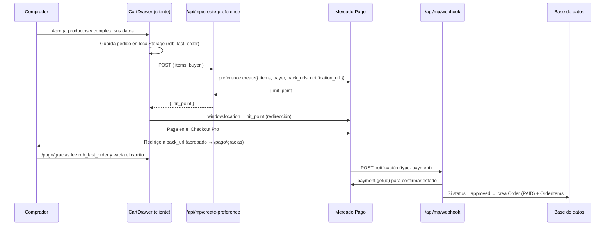

# Sistema de Pagos — Mercado Pago

Documentación punta a punta del checkout de **La Reina de Bastos**, que cobra
mediante **Mercado Pago Checkout Pro** (el comprador es redirigido al checkout
alojado por MP y vuelve al sitio al terminar).

---

## 1. Resumen

- **Modalidad:** Checkout Pro (redirección). No se manejan datos de tarjeta en
  el sitio — MP procesa el pago en su dominio.
- **Cuenta:** un solo vendedor (la marca). Se usa el **access token propio** por
  variable de entorno. El flujo OAuth "Conectar cuenta" existe pero es paralelo
  (ver §8).
- **Moneda:** `ARS` (hardcodeada en la preferencia).
- **Registro:** las órdenes aprobadas se guardan en la tabla `Order` de la DB
  (Supabase/Postgres) desde el **webhook** de MP.

---

## 2. Flujo end-to-end



**Punto clave:** el sitio **no** confía en la redirección para dar el pago por
válido — la fuente de verdad es el **webhook**, que consulta el pago real contra
la API de MP antes de registrar la orden. La redirección solo mejora la UX
(mostrar "gracias" y vaciar el carrito).

---

## 3. Componentes y archivos

| Archivo | Rol |
|---|---|
| [`src/app/_components/cart/CartContext.tsx`](src/app/_components/cart/CartContext.tsx) | Estado del carrito (React Context + `localStorage` `rdb_cart`). Tipos `CartItem`, `BuyerInfo`, `LastOrder`. |
| [`src/app/_components/cart/CartDrawer.tsx`](src/app/_components/cart/CartDrawer.tsx) | UI del carrito y checkout. `handleConfirm` llama a create-preference y redirige a MP. |
| [`src/lib/mercadopago.ts`](src/lib/mercadopago.ts) | Cliente del SDK (`MercadoPagoConfig`) con `MP_ACCESS_TOKEN`. Exporta `mpPreference` y `mpPayment`. |
| [`src/app/api/mp/create-preference/route.ts`](src/app/api/mp/create-preference/route.ts) | Crea la preferencia de pago y devuelve `init_point`. |
| [`src/app/api/mp/webhook/route.ts`](src/app/api/mp/webhook/route.ts) | Recibe notificaciones, valida firma, registra la orden `PAID`. |
| [`src/app/pago/gracias/page.tsx`](src/app/pago/gracias/page.tsx) | Retorno de pago **aprobado**. Muestra resumen y vacía el carrito. |
| [`src/app/pago/error/page.tsx`](src/app/pago/error/page.tsx) | Retorno de pago **rechazado**. |
| [`src/app/pago/pendiente/page.tsx`](src/app/pago/pendiente/page.tsx) | Retorno de pago **pendiente** (ej. efectivo/Rapipago). |
| [`src/app/pago/exito/page.tsx`](src/app/pago/exito/page.tsx) | Página de éxito genérica (no usada por el flujo actual; el éxito va a `/pago/gracias`). |
| [`src/server/api/routers/orders.ts`](src/server/api/routers/orders.ts) | tRPC `orders.create` — registra órdenes `PENDING`. Ya no lo usa el checkout, disponible para uso interno. |
| [`src/app/admin/configuracion/page.tsx`](src/app/admin/configuracion/page.tsx) | Panel admin: conectar/desconectar cuenta de MP vía OAuth (ver §8). |
| [`src/app/api/admin/mp-connect/route.ts`](src/app/api/admin/mp-connect/route.ts) | Inicia el OAuth de MP. |
| [`src/app/api/admin/mp-callback/route.ts`](src/app/api/admin/mp-callback/route.ts) | Callback OAuth; guarda el token en `settings.json`. |
| [`src/lib/settings.ts`](src/lib/settings.ts) | Lee/escribe `settings.json` (token OAuth). |

---

## 4. Variables de entorno

Definidas en `.env` (local) y en el env del hosting (producción). El schema vive
en [`src/env.js`](src/env.js).

| Variable | Ámbito | Requerida | Descripción |
|---|---|---|---|
| `MP_ACCESS_TOKEN` | servidor | **Sí** | Access token de la cuenta de MP. **Es lo que autoriza los cobros.** `TEST-…` para pruebas, `APP_USR-…` para producción. |
| `NEXT_PUBLIC_MP_PUBLIC_KEY` | cliente | Recomendada | Public key. No hace falta para la redirección, sí para futuros bricks/Wallet en el sitio. |
| `MP_WEBHOOK_SECRET` | servidor | Recomendada | Secret del webhook (panel de MP). Si está vacío, **la firma NO se valida** (se acepta todo). |
| `NEXT_PUBLIC_SITE_URL` | cliente | **Sí en prod** | URL pública del sitio. Base de los `back_urls` y del `notification_url`. En producción debe ser el dominio **https** real. |
| `MP_APP_ID` | servidor | Solo OAuth | Client ID de la aplicación de MP (flujo "Conectar cuenta"). |
| `MP_APP_SECRET` | servidor | Solo OAuth | Client Secret de la aplicación de MP. |

> ⚠️ **Producción cobra plata real.** Con credenciales `APP_USR-` cualquier pago
> es real. Para desarrollo usá las credenciales de **TEST** del mismo panel.
>
> ⚠️ El `.env` está en `.gitignore` — **nunca** se commitea. Las credenciales de
> producción se cargan en el env del hosting (Vercel/VPS), no en el repo.

---

## 5. `create-preference` en detalle

**Endpoint:** `POST /api/mp/create-preference`

**Body:**
```json
{
  "items": [
    { "id": "abc", "name": "Cristal de cuarzo", "price": 5000, "quantity": 1, "itemType": "PRODUCT" }
  ],
  "buyer": {
    "name": "Ana",
    "apellido": "García",
    "email": "ana@ejemplo.com",
    "phone": "+54 9 11 1234-5678"
  }
}
```

**Qué hace:**
1. Valida que haya ítems.
2. Arma `payer` con los datos del comprador para **prellenar** el checkout de MP.
3. Codifica los ítems en `external_reference` como base64(JSON) para que el
   webhook sepa qué se compró.
4. Setea `back_urls` (éxito → `/pago/gracias`, error → `/pago/error`,
   pendiente → `/pago/pendiente`), `auto_return: "approved"` y
   `notification_url` → `/api/mp/webhook`.
5. Devuelve `{ id, init_point, sandbox_init_point }`.

**Respuesta:**
```json
{ "id": "…", "init_point": "https://www.mercadopago.com/…", "sandbox_init_point": "https://sandbox.mercadopago.com/…" }
```

El cliente redirige a `init_point` (o `sandbox_init_point` como fallback).

---

## 6. Webhook en detalle

**Endpoint:** `POST /api/mp/webhook` (configurado como `notification_url`)

1. **Validación de firma** (si `MP_WEBHOOK_SECRET` está seteado): reconstruye el
   manifest `id:<data.id>;request-id:<x-request-id>;ts:<ts>;` y compara el
   HMAC-SHA256 contra el `v1` del header `x-signature`. Si no coincide → `401`.
   Si el secret está vacío, se omite la validación.
2. Solo procesa notificaciones `type: "payment"`.
3. Hace `payment.get(id)` para traer el pago **real** desde MP.
4. Si `status === "approved"`:
   - Decodifica `external_reference` (base64 → ítems).
   - Crea una `Order` con `status: PAID`, `mpPaymentId`, email del pagador y sus
     `OrderItem`.
5. Responde `200 { ok: true }` (siempre que no falle) para que MP no reintente.

> El webhook necesita ser **públicamente accesible por HTTPS**. En local no
> recibe notificaciones salvo que expongas un túnel (ngrok, cloudflared).

---

## 7. Modelo de datos

Definido en [`prisma/schema.prisma`](prisma/schema.prisma).

```prisma
enum OrderStatus { PENDING  PAID  FAILED  CANCELLED }
enum ItemType    { PRODUCT  COURSE  SERVICE }

model Order {
  id          String      @id @default(cuid())
  userId      String?
  email       String
  status      OrderStatus @default(PENDING)
  total       Float
  mpPaymentId String?
  mpPrefId    String?
  createdAt   DateTime    @default(now())
  updatedAt   DateTime    @updatedAt
  items       OrderItem[]
}

model OrderItem {
  id        String   @id @default(cuid())
  orderId   String
  itemType  ItemType
  productId String?
  courseId  String?
  serviceId String?
  quantity  Int      @default(1)
  price     Float
  name      String
}
```

Antes de que el webhook pueda guardar órdenes, la tabla tiene que existir en la
DB: `npm run db:push` (o `npm run db:migrate` en producción).

---

## 8. Token directo vs OAuth (importante)

Hay **dos** caminos de credenciales en el código:

- **Token directo (el que cobra):** `create-preference` y el webhook usan
  `mpPreference`/`mpPayment` de [`src/lib/mercadopago.ts`](src/lib/mercadopago.ts),
  que lee `process.env.MP_ACCESS_TOKEN`. **Este es el flujo activo.**
- **OAuth "Conectar cuenta" (admin):** el panel `/admin/configuracion` permite
  autorizar una cuenta de MP; el token resultante se guarda en `settings.json`
  vía [`src/lib/settings.ts`](src/lib/settings.ts).

> ⚠️ **Hoy `create-preference` NO lee el token de `settings.json`** — usa siempre
> el de `MP_ACCESS_TOKEN`. Es decir, el estado "Conectado" del panel admin es
> informativo: lo que efectivamente cobra es la variable de entorno. Para una
> tienda de un solo vendedor, con setear `MP_ACCESS_TOKEN` alcanza. Unificar
> ambos caminos (que `create-preference` prefiera el token de settings) queda
> como mejora futura.

---

## 9. Probar en desarrollo (sin cobrar)

1. En `.env`, poné las credenciales de **TEST** (`TEST-…`) del panel de MP.
2. `npm run dev` y abrí la tienda.
3. Agregá productos, completá tus datos y "Pagar con Mercado Pago".
4. Pagá con una **tarjeta de prueba** de MP
   (ver [tarjetas de prueba](https://www.mercadopago.com.ar/developers/es/docs/checkout-pro/additional-content/test-cards)).

**Para probar el webhook en local** necesitás exponer el puerto con un túnel
(ngrok/cloudflared) y usar esa URL pública como `NEXT_PUBLIC_SITE_URL`, porque MP
tiene que poder alcanzar `/api/mp/webhook` desde internet.

> Con credenciales de producción + `localhost`, MP suele **rechazar** el
> `auto_return`/`back_urls`. El testing real se hace en el dominio https.

---

## 10. Checklist de producción

- [ ] Cargar en el env del hosting: `MP_ACCESS_TOKEN` (`APP_USR-…`),
      `NEXT_PUBLIC_MP_PUBLIC_KEY`, `NEXT_PUBLIC_SITE_URL` (dominio https real).
- [ ] Crear el webhook en el panel de MP → URL
      `https://TU-DOMINIO/api/mp/webhook`, evento **Pagos**.
- [ ] Copiar el *secret* del webhook a `MP_WEBHOOK_SECRET`.
- [ ] Aplicar migraciones: `npm run db:migrate` (o `db:push`).
- [ ] Hacer una compra real de prueba (monto chico) y verificar que:
      redirige a MP → vuelve a `/pago/gracias` → aparece la `Order` `PAID` en la DB.
- [ ] Confirmar la moneda (`ARS`) en `create-preference` si vendés en otra.

---

## 11. Seguridad

- **Nunca** commitear `.env` ni credenciales. Están en `.gitignore`.
- Si un token se expuso (chat, captura, repo), **rotarlo** en el panel de MP.
- Mantener `MP_WEBHOOK_SECRET` seteado en producción para validar que las
  notificaciones vienen realmente de MP.
- El webhook confirma el pago contra la API de MP (`payment.get`) — no confía en
  el body de la notificación para el monto/estado.

---

## 12. Errores comunes

| Síntoma | Causa probable | Solución |
|---|---|---|
| `Error al crear preferencia de pago` (500) | `MP_ACCESS_TOKEN` inválido/vacío | Revisar la variable en el env. |
| MP rechaza el `auto_return` | `back_urls` con `http`/`localhost` en modo producción | Usar dominio https real en `NEXT_PUBLIC_SITE_URL`. |
| El pago se aprueba pero no aparece la orden | Webhook no configurado, no accesible, o falta la tabla en DB | Configurar webhook, exponer HTTPS, correr migraciones. |
| Webhook responde `401` | `MP_WEBHOOK_SECRET` no coincide con el del panel | Copiar el secret correcto. |
| El carrito no se vacía tras pagar | No se llegó a `/pago/gracias` | Verificar `back_urls.success`. |

---

_Última actualización: implementación del checkout con Checkout Pro
(commit `a8b971c`)._
